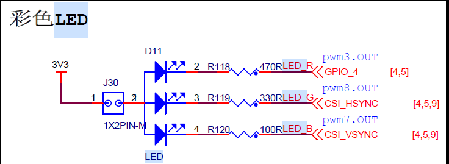

# 一、汇编LED原理分析

为什么要学习Cortex-A汇编：

·   ①、需要用汇编初始化一些SOC外设。

​    ②、使用汇编初始化DDR，I.MX6U不需要。I.MX内部的ROM,NXP在内部96KB的ROM中存放了自己编写的启动代码，这些启动代码可以读取DDR配置信息，并且完成DDR的初始化。

​    ③、设置sp指针，一般指向DDR，设置好C语言运行环境。

##   1、ALPHA/野火开发板LED灯硬件原理分析：

​    STM32 IO初始化流程：

​    ①、使能GPIO时钟。

​    ②、设置IO复用，将其复用为GPIO

​    ③、配置GPIO的电气属性。

​    ④、使用GPIO，输出高/低电平。

