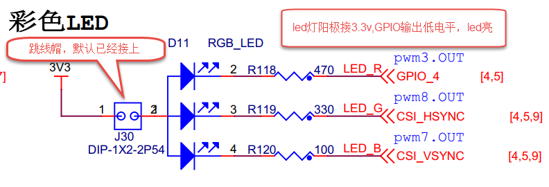
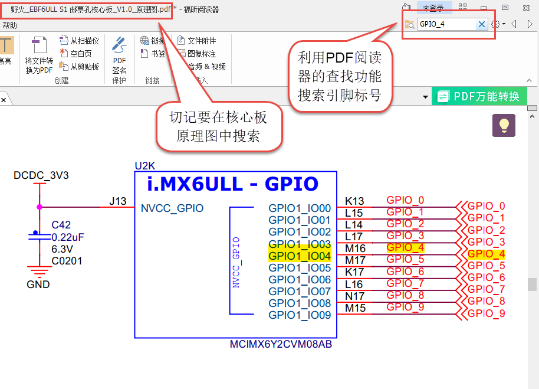
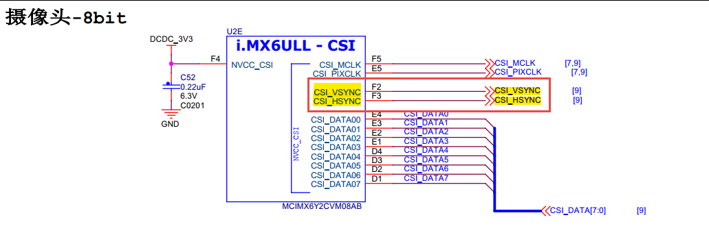
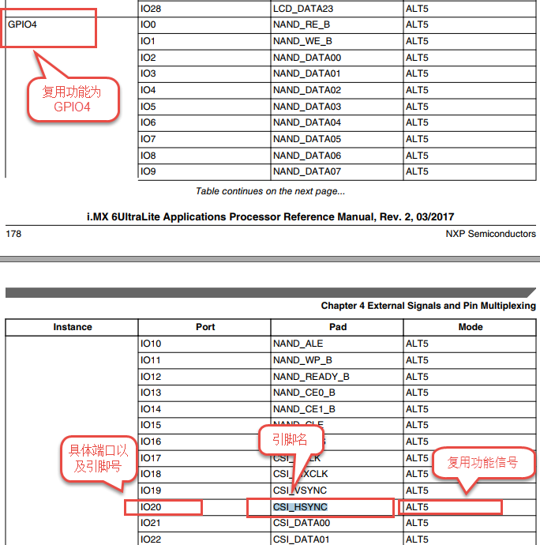

# 一、汇编LED原理分析

为什么要学习Cortex-A汇编：

·   ①、需要用汇编初始化一些SOC外设。

​    ②、使用汇编初始化DDR，I.MX6U不需要。I.MX内部的ROM,NXP在内部96KB的ROM中存放了自己编写的启动代码，这些启动代码可以读取DDR配置信息，并且完成DDR的初始化。

​    ③、设置sp指针，一般指向DDR，设置好C语言运行环境。

##   1、ALPHA/野火开发板LED灯硬件原理分析：

​    ### STM32 IO初始化流程：

​    ①、使能GPIO时钟。

​    ②、设置IO复用，将其复用为GPIO

​    ③、配置GPIO的电气属性。

​    ④、使用GPIO，输出高/低电平。

​    ### I.MX6ULL IO初始化：

​    ①、使能时钟，CCGR0\~CCGR6这7个寄存器控制着6ULL所有外设时钟的使能。为了简单，设置CCGR0~CCGR6这7个寄存器全部为0XFFFFFFFF，相当于使能所有外设时钟。

​    ②、IO复用，将寄存器IOMUXC_SW\_**MUX**_CTL_PAD_GPIO1_IO03的bit3~0设置为0101=5，这样GPIO1_IO03就复用为GPIO。

​    ③、寄存器IOMUXC_SW_**PAD**_CTL_PAD_GPIO1_IO03是设置GPIO1_IO03的**电气属性**。包括压摆率、速度、驱动能力、开漏、上下拉等。

​    ④、配置GPIO功能，设置输入输出。设置GPIO1_DR寄存器bit3为1，也就是设置为输出模式。设置GPIO1_GDIR寄存器的bit3，为1表示输出高电平，为0表示输出低电平。

​    

## 硬件连接

从原理图可看到RGB灯的三个阴极R、G、B连接分别连接至标号GPIO_4、CSI_HSYNC、CSI_VSYNC，这些标号实际上与配套核心板上i.MX6ULL芯片的引脚相连。由于引脚功能众多， 绘制原理图时不可避免地无法完全表示引脚信息的所有信息。而无论是具体的引脚名还是复用功能， 我们都无法直接得知这些具体是i.MX 6U芯片的哪个引脚。我们需要知道这些引脚是对应的具体GPIO，这样我们才能编写程序进行控制。由于还不清楚标号GPIO_4、CSI_HSYNC、CSI_VSYNC的具体引脚名，我们首先要在核心板原理图中查看它与i.MX6ULL芯片的关系。

### 查看核心板原理图

我们查找到了GPIO_4信号的具体引脚名为GPIO1_IO04。 但是当我们使用同样的方法查找时发现只能找到CSI_HSYNC、CSI_VSYNC， 并没有我们熟悉的GPIOx_IOx标注的引脚名，如下。

原因很简单，这两个引脚默认情况下不用作GPIO，而是用作摄像头的某一功能引脚，但是它可以复用为GPIO，我们怎么找到对应的GPIO呢？ 第一种，在《i.MX 6UltraLite Applications Processor Reference Manual》的第4章External Signals and Pin Multiplexing搜索引脚名， 以CSI_HSYNC为例，如下所示。

从中可以看出CSI_HSYNC可以复用为对应的GPIO引脚为GPIO4_IO20。

表 48-1与LED灯连接的各个引脚信息及GPIO复用编号

| LED灯 | 原理图的标号 | 具体引脚名 | GPIO端口及引脚编号 |
| ----- | ------------ | ---------- | ------------------ |
| R灯   | GPIO_4       | GPIO1_IO04 | GPIO1_IO04         |
| G灯   | CSI_HSYNC    | CSI_HSYNC  | GPIO4_IO20         |
| B灯   | CSI_VSYNC    | CSI_VSYNC  | GPIO4_IO19         |

三、汇编简介

​    汇编由一条一条指令构成，指令就涉及到汇编指令。

Int a，b;

a=b;

假设a地址为0X20，b地址为0x30

 

LDR R0, =0X30

LDR R1, [R0]

LDR R0, =0X20

STR R1, [R0]

LDR R0,=0x30
LDR R1, [R0]
LDR R0,=0x20
STR R1,[R0]

​    我们在使用汇编编写驱动的时候最常用的就是LDR和STR这两个指令。

# 四、编写驱动

 

# 五、编译程序

​    1、编译程序 

①、使用arm-linux-gnueabihf-gcc，将.c .s文件变为.o

②、将所有的.o文件连接为elf格式的可执行文件。

③、将elf文件转为bin文件。

④、将elf文件转为汇编，反汇编。

​    

链接：

链接就是将所有.o文件链接在一起，并且链接到指定的地方。本实验链接的时候要指定链接起始地址。链接起始地址就是代码运行的起始地址。

对于6ULL来说，链接起始地址应该指向RAM地址。RAM分为内部RAM和外部RAM，也就是 DDR。6ULL内部RAM地址范围0X900000~0X91FFFF。也可以放到外部DDR中，对于I.MX6U-ALPHA开发板，512MB字节DDR版本的核心板，DDR范围就是0X80000000~0X9FFFFFFF。对于256MB的DDR来说，那就是0X80000000~0X8FFFFFFF。

​    本系列视频，裸机代码的链接起始地址为0X87800000。要使用DDR，那么必须要初始化DDR，对于I.MX来说bin文件不能直接运行，需要添加一个头部，这个头部信息包含了DDR的初始化参数，I.MX系列SOC内部boot rom会从SD卡，EMMC等外置存储中读取头部信息，然后初始化DDR，并且将bin文件拷贝到指定的地方。

​    Bin的运行地址一定要和链接起始地址一致。位置无关代码除外。

 

# 六、烧写bin文件

​    STM32烧写到内部FLASH。

​    6ULL支持SD卡、EMMC、NAND、nor、SPI flash等等启动。裸机例程选择烧写到SD卡里面。

​    在ubuntu下向SD卡烧写裸机bin文件。烧写不是将bin文件拷贝到SD卡中，而是将bin文件烧写到SD卡绝对地址上。而且对于I.MX而言，不能直接烧写bin文件，比如先在bin文件前面添加头部。完成这个工作，需要使用正点原子提供的imxdownload软件。

​    Imxdownload使用方法，确定要烧写的SD卡文件，我的是/dev/sdf。

​    给予imxdownload可执行权限：

Chmod 777 imxdownload

​    烧写：

​    ./imxdownload led.bin /dev/sdf

​    Imxdownlaod会向led.bin添加一个头部，生成新的load.imx文件，这个load.imx文件就是最终烧写到SD卡里面去的。